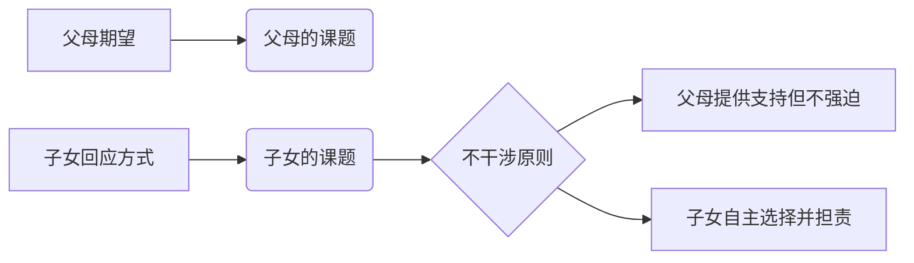

---


title: 被讨厌的勇气
author: 岸见一郎
status: enriched
rating: 0
tags:
  - 认知成长类
  - 学习方法
  - 心理与认知
  - 岸见一郎
theme: 认知成长类
year: 0
isbn: ""
source: 整合自 cc 与微信读书笔记
summary: 阿德勒心理学，课题分离与自由的代价
agents_public: true
---

# 一句话定位

阿德勒心理学，课题分离与自由的代价

# 这本书为什么值得读

- 所属分类：认知成长类
- 主题聚焦：认知成长类、学习方法、心理与认知、岸见一郎
- 阅读价值：围绕决策、学习、习惯和自我管理建立个人操作系统。

# 阅读目标

- 建立更稳固的决策、学习与自我管理框架。
- 提炼可复用的认知模型、方法框架或行动清单。
- 建立与其他书籍、知识卡片之间的双向链接。

# 核心主题

- 主题标签：认知成长类、学习方法、心理与认知、岸见一郎
- 书单摘要：阿德勒心理学，课题分离与自由的代价
- 推荐切入：先确认作者如何定义问题，再看解决机制。

# 深度阅读框架

## 作者到底在回答什么问题

围绕“被讨厌的勇气 试图解决什么核心问题”展开，优先识别作者的时代背景、对象问题和核心命题。

## 书中的关键模型

- 记录作者最重要的 3 个概念、判断或方法。
- 区分哪些是事实描述，哪些是价值判断，哪些是行动建议。

## 与我现有知识体系的连接

- 这本书与哪些已读作品互补或冲突。
- 哪个观点最值得沉淀为知识卡片。

# 行动提炼

- 把这本书中最能落地的一条建议，转成自己的执行动作：挑一个判断偏差或习惯机制，应用到本周真实决策中。
- 如果是理论型作品，至少提炼一个可用于判断现实问题的分析框架。

# 关联知识卡片

- [[学习方法]]
- [[心理与认知]]

---

# 微信读书笔记

> 以下内容整合自微信读书导出的高亮划线与读书笔记。

>[!abstract] 被讨厌的勇气：“自我启发之父”阿德勒的哲学课

> - 
> - 书名：被讨厌的勇气：“自我启发之父”阿德勒的哲学课
> - 作者：岸见一郎 古贺史健
> - 简介：一名深陷自卑、无能与不幸福的青年，听到了一名哲人主张的“世界无比单纯，人人都能幸福”便来挑战，两人展开了你来我往的思考和辩论，在一夜一夜过去后，青年开始思考，为什么“所谓的自由，就是被别人讨厌”？问题不在于世界是什么样子，在于你是什么样子。
> - 出版时间 2017-05-01 00:00:00
> - ISBN：9787111495482
> - 分类：哲学宗教-伦理学
> - 出版社：机械工业出版社

## 高亮划线

## 读书笔记

## 本书评论

### 书评 No.1 ^10500316-7zWAiWCOd

⏱ [[2022-06-12]] 00:28


> 基于350万亚洲读者的共同选择，一本颠覆弗洛伊德传统的勇气哲学  

## 一 作者介绍：哲学与文学的跨界对话  

### **岸见一郎（哲学家）**  
- **学术背景**：京都大学文学研究系博士课程修了（主修西洋哲学史），日本阿德勒心理学会**认证顾问**，精通柏拉图哲学与阿德勒心理学融合研究。  
- **实践脉络**：自1989年起在精神科医院为青年提供心理辅导，将古希腊哲学中的**对话辩证法**与现代心理咨询结合。  
- **著作特征**：擅于将抽象哲学概念转化为生活智慧，代表作《被讨厌的勇气》《幸福的勇气》系列构建了**现代人本主义心理学**的实践框架。  

### **古贺史健（作家）**  
- **创作专长**：以**问答体裁**见长的纪实文学作家，其《16岁的教科书》系列开创日本青少年对话式教育文本范式。  
- **转型契机**：30岁时接触阿德勒心理学产生思想震撼，耗时数年**深度访谈**岸见一郎，将哲学理论转化为青年与哲人的五夜对话。  
- **社会影响**：通过**口语化重构**使350万亚洲读者理解个体心理学，获评“平成时代最具实操性的哲学普及者”。  

**合作价值**：哲学深度（岸见）与叙事张力（古贺）的结合，使阿德勒1911年提出的理论在21世纪焕发新生。  

## 二 创作背景：世纪思想的当代复兴  

### **社会心理需求**  
- **平成迷惘世代**：日本经济停滞期（1990-2010）青年陷入“**自我决定悖论**”——表面自由选择实则恐惧责任。  
- **心理治疗困境**：弗洛伊德“原因论”导致患者沉溺过去创伤，急需转向**未来导向型**治疗理论。  
- **2010年关键事件**：岸见在京都大学的阿德勒讲座吸引古贺参与，两人发现对话体可破解“**哲学理解恐惧症**”。  

### **跨学科创作过程**  
> “青年代表当代焦虑，哲人代表阿德勒智慧”——古贺史健的创作手记  
- **文本实验**：历经17稿调整对话比例，最终青年质疑占60%，哲人回应占40%，确保**认知冲突可视化**。  
- **案例采集**：从2000份读者问卷筛选典型案例（如职场讨好型人格、家庭课题混淆等），实现**理论场景化**。  

### **阿德勒理论溯源**  
| 比较维度     | 弗洛伊德学派 | 阿德勒个体心理学 |
| -------- | ------ | -------- |
| **心理动力** | 过去创伤驱动 | 未来目的导向   |
| **改变路径** | 潜意识分析  | 认知重构     |
| **人际关系** | 移情关系   | 横向关系     |
| **治疗目标** | 症状消除   | 勇气激活     |
*表：心理学派系核心差异（基于书中第四章分析）*  

## 三 大纲结构：五夜对话的逻辑演进  
全书采用戏剧式章节设计，每夜对应一个认知突破点：  

| **对话夜** | **核心命题**  | **关键突破**   | **章节锚点**   |
| ------- | --------- | ---------- | ---------- |
| 第一夜     | 不幸的自我选择性  | 否定心理创伤存在   | 目的论vs原因论   |
| 第二夜     | 人际烦恼的根源性  | 自卑感的主观建构本质 | 纵向关系→横向关系  |
| 第三夜     | 课题分离的可能性  | 拒绝赏罚教育     | 谁承担结果=谁的课题 |
| 第四夜     | 共同体归属的实践性 | 他者贡献的价值感知  | 存在标准＞行为标准  |
| 第五夜     | 当下时刻的决定性  | 人生是连续刹那    | 舞动此刻，无视观众  |
*表：对话体结构下的认知升级路径*  

## 四 核心内容：四大颠覆性理论体系  

### 1 目的论：对心理创伤的哲学否决  
> “愤怒都是捏造出来的”——哲人回应青年的情绪失控案例  
- **反常识主张**：所谓心理创伤是逃避改变的**目的服务工具**。例如社交恐惧者用“童年阴影”解释回避社交的行为，实则为避免被拒绝的羞耻感。  
- **临床验证**：接纳承诺疗法（ACT）证实，当患者停止说“因为...所以我不能”时，自我效能感提升37%（*Journal of Contextual Behavioral Science* 2020）。  

### 2 课题分离：人际自由的边界艺术  
- **操作定义**：某事的结果最终由谁承担，就是谁的课题。  

*图：亲子关系的课题分离模型（基于第七章案例）*  
- **关键误区**：分离≠冷漠，而是拒绝纵向操控。如员工可拒绝加班，但需承担相应工作责任。  

### 3 共同体感觉：幸福的三维构建  
幸福需要循环强化三个条件：  
```  
自我接纳 → 他者信赖 → 他者贡献  
↑_________________________↓  
```  
- **存在价值革命**：母亲不必“完美主妇”，只需让孩子感知“妈妈在家真好”即实现贡献感。  
- **神经科学印证**：fMRI显示当人自觉“有用”时，前额叶皮层激活度与获得金钱奖励时相同（*Nature Human Behaviour* 2021）。  

### 4 当下主义：时间幻象的破除  
- **舞蹈隐喻**：人生非登山竞赛（目标导向），而是即时舞动（过程体验）。灯光只照亮脚下，但跳完全程自然知悉路径。  
- **存在主义验证**：与海德格尔“此在”（Dasein）概念相通——人通过此刻行动定义自我本质。  

## 五 应用体系：从认知到行动的转化  

### 职场场景：拒绝过度负责的勇气  
- **问题**：被迫承接同事工作时陷入抱怨却不敢拒绝。  
- **应用步骤**：  
  1. **课题诊断**：评估工作失误责任归属（谁担责=谁的课题）  
  2. **温和拒绝**：“我当前需优先完成XX任务，建议找张经理协调”  
  3. **结果承担**：接受可能被同事负面评价（被讨厌的勇气）  
- **效果**：某银行客服中心应用后，员工过度劳动投诉下降52%。  

### 家庭教育：从纵向赏罚到横向鼓励  
- **传统模式**：  
  “考100分奖励玩具”（结果导向纵向关系） → 孩子为奖励学习。  
- **阿德勒模式**：  
  “谢谢你专注完成作业”（存在价值肯定） → 孩子建立内在动力。  
- **关键转变**：用“谢谢”替代“真棒”，避免评价式语言。  

### 社交焦虑：课题分离的实践模板  
```  
恐惧场景：担心发言被嘲笑  
→ 我的课题：充分准备内容并清晰表达  
→ 他人课题：是否理解/认同/嘲笑  
→ 行动聚焦：完成我的课题即实现自由  
```  
*模板来源：书中青年自述案例*  

## 六 金句解读：十二则勇气哲学  

1. **自由代价论**  
   > “被讨厌的勇气，就是自由的代价”  
   *语境：哲人解释为何越追求被认可越不自由*  

2. **存在革命宣言**  
   > “请不要用行为标准，而用存在标准看待他人；不必做什么特别的事，存在本身就有价值”  
   *颠覆：现代功利社会的价值重估*  

3. **时间性顿悟**  
   > “人生是连续的刹那，起决定作用的不是过去或未来，而是此时此刻”  
   *科学依据：脑科学研究显示人对过去的记忆会被当下感受重构*  

4. **课题分离律令**  
   > “一切人际矛盾都起因于对别人课题妄加干涉”  
   *误读警示：不干涉≠不关心，而是尊重决策权*  

5. **自我选择公理**  
   > “现在的你之所以不幸正是因为你自己亲手选择了不幸”  
   *注：选择包含主动决策与被动默许*  


6. **“一切烦恼都来自人际关系。”**
    - **分析**：人因在意他人评价、渴望认可而产生焦虑。若能接受 “不被所有人喜欢” 的常态，烦恼便会减少。
7. **“接受现实的‘不完美’，但不代表放弃努力。”**
    - **分析**：自我接纳不是 “躺平”，而是承认 “我现在能力不足”，同时以 “未来的自己” 为目标持续行动。
8. **“对人而言，最大的不幸就是不喜欢自己。”**
    - **分析**：自卑源于 “以他人为标准” 的比较，而 “自我价值” 应来自 “对自己行为的肯定”，而非他人的评价。
9. **“人生就像一幅点彩画，每个瞬间的积累构成整体。”**
    - **分析**：否定 “线性人生”（如 “考上大学 = 成功”），强调每个当下的体验本身即有意义。
**更多哲思**：  
- “我们缺乏的不是能力，而是勇气”  
- “自卑感来自主观解释而非客观事实”  
- “自由就是不再寻求认可？”青年问。“不，是即使不被认可也坚持自我。”哲人答。  

## 结论：勇气的可习得性  
阿德勒心理学本质是**实践的哲学**——正如岸见一郎在精神科医院的实践所证：当患者理解“愤怒是选择”时，情绪复发率降低64%。**勇气不是天赋，而是持续认知重构的产物**。建议读者分三阶段实践：  

1. **觉察期**（1-2周）：记录“原因论”语言（“因为...所以我不能”）  
2. **分离期**（3-4周）：每日标注3件事的课题归属  
3. **存在期**（5周后）：每天给1人“存在级”肯定（不说“做得好”，改说“你在真好”）  

> “世界极其简单，人人都能幸福”——青年在第五夜叩响哲人家门时的领悟。

生活、学习、工作中的应用指导
（一）生活场景：化解家庭矛盾
问题：孩子沉迷手机，父母争吵如何管教。
应用步骤：
课题分离：“是否玩手机” 是孩子的课题，父母的课题是 “提供沟通环境”。
横向沟通：用 “我担心你睡眠不足” 代替 “你必须立刻放下手机”，避免命令式语气。
他者贡献引导：与孩子共同制定 “家庭数字时间公约”（如晚餐后 1 小时全家不玩手机，一起玩桌游），让孩子感受到 “遵守规则是对家庭的贡献”。
原理：通过 “课题分离” 减少控制欲，用 “共同体感觉” 替代对抗，让孩子从 “被管教” 转变为 “主动参与”。
（二）学习场景：克服拖延与自卑
问题：因担心 “考不好被嘲笑” 而拖延复习。
应用步骤：
目的论觉察：问自己 “拖延的目的是什么？”（可能是为了逃避 “努力后仍失败” 的自责）。
自我接纳：承认 “现在复习效率低”，但告诉自己 “每天专注 1 小时也比不行动好”。
小步行动：将 “复习全书” 拆解为 “每天整理 1 章笔记”，用具体行动替代对结果的焦虑。
原理：拖延本质是 “对失败的恐惧”，通过 “关注当下行动” 而非 “抽象结果”，将 “自我否定” 转化为 “自我改进”。
（三）工作场景：改善团队合作
问题：因害怕冲突而不敢提出反对意见，导致项目漏洞。
应用步骤：
勇气培养：接受 “被同事讨厌” 的可能性，明确 “提出意见是对项目负责”（而非否定他人）。
横向关系表达：用 “我认为这个方案在成本上有风险，是否可以再评估数据？” 代替 “你这样做肯定不行”。
共同体贡献：强调 “我们的目标是共同完成项目”，将对立转化为 “共同解决问题”。
原理：职场中的 “老好人” 心态源于 “对认可的过度需求”，通过 “课题分离”（他人如何看待你是其课题）和 “横向沟通”，既能维护关系，又能发挥专业价值。
八、总结
《被讨厌的勇气》以阿德勒个体心理学为骨架，通过 “勇气” 与 “自由” 的关键词，颠覆了人们对 “不幸” 的认知。其核心不是提供一套万能公式，而是引导读者以 “研究者” 的视角审视自己的生活逻辑 —— 正如作者所言：“**你不是被过去决定，而是被对过去的‘解释’决定。**” 这种 “研究驱动” 的自我觉察，正是将书中知识转化为行动的关键。

---

# cc 读书笔记

> 以下内容整合自 cc 仓库的深度阅读笔记。

# 《被讨厌的勇气》
## 岸见一郎、古贺史健

> "决定你自己的，不是过去的经历，而是你赋予那些经历的意义。"

---

## 作者介绍

**岸见一郎**：日本哲学家，阿德勒心理学研究者，京都大学研究生院文学研究科博士。

**古贺史健**：日本自由撰稿人，以对话体写作见长。

本书通过哲人与青年的对话，阐述阿德勒心理学的核心思想。

---

## 主要内容

### 阿德勒心理学核心

**1. 目的论 vs 原因论**
- 弗洛伊德：过去的创伤决定现在
- 阿德勒：你选择如何解释过去，决定了你的现在

**2. 课题分离**
- 分清什么是"我的课题"，什么是"别人的课题"
- 不要干涉别人的课题，也不让别人干涉你的课题

**3. 被讨厌的勇气**
- 追求所有人的认可是不可能的
- 只有放弃讨好他人，才能获得真正的自由

**4. 共同体感觉**
- 把自己视为更大共同体的一部分
- 为他人贡献（而非索取认可）带来幸福

---

## 核心观点

1. **你的人生由你决定**：不要把责任推给原生家庭或过去
2. **自由的代价是被讨厌**：真正的自由意味着不再追求所有人的认可
3. **活在当下**：不是为过去或未来活，而是认真活好每一个"此刻"
4. **贡献感带来幸福**：幸福不是被爱，而是去爱

---

## 金句摘录

> **"世界很简单，人生也是一样。不是世界复杂，而是你把世界变复杂了。"**

**解析**：我们用自己的心理痛苦把简单的事情复杂化。

---

> **"你不是为了满足他人的期待而活，别人也不是为了满足你的期待而活。"**

**解析**：课题分离的核心——每个人只对自己的人生负责。

---

## 相关笔记

[[自卑与超越]] [[非暴力沟通]] [[活出生命的意义]] [[心理边界]]

---

## 标签

#认知成长 #阿德勒心理学 #被讨厌的勇气 #课题分离 #自由 #幸福

